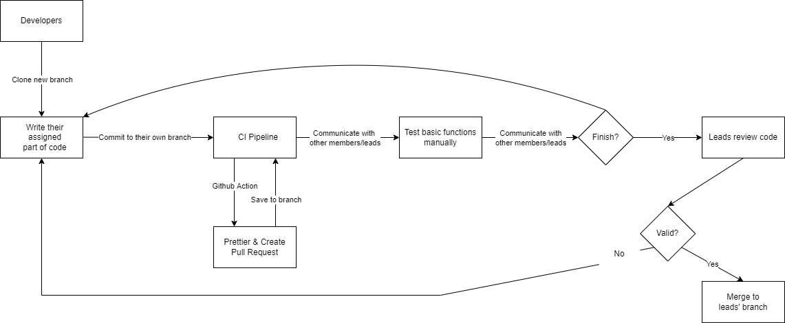

# Phase 1 Pipeline Introduction

If the picture is not clear, please review the originial diagram `phase1.drawio`.

---

## How does our pipeline work?

Our work cycle starts every week after our team meeting. First of all, frontend/backend leads will create a separate branch for their members to merge the code into. During the meeting, we will assign specific task to each member, and from there they will write their part of the code. After they are done with their code, they should commit it to their branch. With Prettier and Create Pull Request setted up as Github Actions, their code will be automatically updated for styles and created a pull request to a new branch. Then, developers can communicate with others to have them check if all the code works fine. After peer review and discussion, developers can either go back and modify their code if necessary or finish their part, having frontend/backend leads review their code. If their code passes, the leads will merge their code to the frontend/backend branch accordingly, and prepare to show them in the next meeting.

In the future, we plan to include some documentation tool as Github Action so that we do not need to write documentations manually. Unit tests via automation are also important, and it is in our target. We might also adjust current Github Actions if necessary.

---

Some specific description of the functions of Prettier and Create Pull Request:

### [Prettier](https://github.com/marketplace/actions/prettier-action)

It is a GitHub action for automatically styling files with the support of multiple languages. With this tool, we do not need to manually check for styles, which is a waste of time and energy.
Behavior: automatically create a new commit with updated style in designated files.
Triggered at new pull request or when pushed to main

### [Create Pull Request](https://github.com/marketplace/actions/create-pull-request)

A GitHub action to create a pull request for changes to your repository in the actions workspace.

Changes to a repository in the Actions workspace persist between steps in a workflow. This action is designed to be used in conjunction with other steps that modify or add files to your repository. The changes will be automatically committed to a new branch and a pull request created.

Create Pull Request action will:

1. Check for repository changes in the Actions workspace. This includes:
   - untracked (new) files
   - tracked (modified) files
   - commits made during the workflow that have not been pushed
2. Commit all changes to a new branch, or update an existing pull request branch.
3. Create a pull request to merge the new branch into the base—the branch checked out in the workflow.
