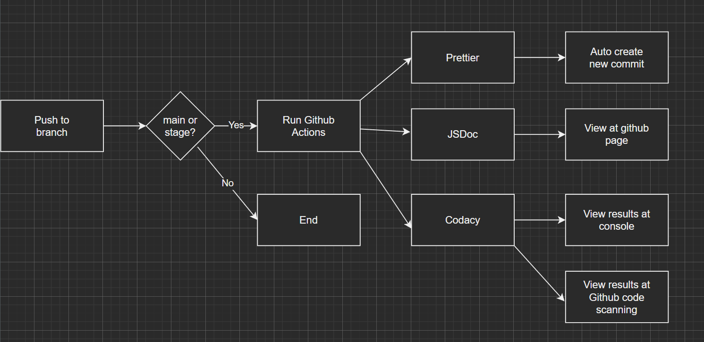

# Phase 2 Pipeline Introduction

If the picture is not clear, please review the originial diagram `phase2.drawio`.

---

## How does our pipeline work?

Currently we are using JSDoc, Prettier, and Codacy Analysis CLI as our github actions in our CI/CD pipeline. We have removed Create Pull Request because it is redundent and we no longer need it. These actions will be triggered when push to the main branch and the stage branch. 

---

Some specific description of the functions of Prettier and Create Pull Request:

### [Prettier](https://github.com/marketplace/actions/prettier-action)

It is a GitHub action for automatically styling files with the support of multiple languages. With this tool, we do not need to manually check for styles, which is a waste of time and energy.
Behavior: automatically create a new commit with updated style in designated files.
Triggered at new pull request or when pushed to main

### [JSDoc Action](https://github.com/marketplace/actions/jsdoc-action)

This is a GitHub Action to build your JavaScript documentation with JSDoc. This action can easily be combined with other deployment actions, in order to publish the generated documentation to for example GitHub Pages. JSDoc templates are also supported.

We have modified the script because JSDoc does not automatically create a new commit to save the generated documents. Therefore, everytime it runs, it will save the documents to our github page link under `/docs` page, where we can review them. However, if JSDoc runs again, it will replace all previous documents. 

### [Codacy Analysis CLI](https://github.com/marketplace/actions/codacy-analysis-cli)

Codacy is an automated code review tool that makes it easy to ensure your team is writing high-quality code by analyzing more than 30 programming languages such as PHP, JavaScript, Python, Java, and Ruby. Codacy allows you to define your own quality rules, code patterns and quality settings you'd like to enforce to prevent issues on your codebase.

The Codacy GitHub Action supports the following scenarios: *(we use both scenarios)*

- Analysis with default settings: Analyzes each commit and pull request and fails the workflow if it finds issues in your code.
    - By default, the Codacy GitHub Action:
        - Analyzes each commit or pull request by running all supported static code analysis tools for the languages found in your repository.
        - Prints the analysis results on the console, which is visible on the GitHub Action's workflow panel.
        - Fails the workflow if it finds at least one issue in your code.
- Integration with GitHub code scanning: Analyzes each commit and pull request and uploads the results to GitHub, which displays the identified issues under your repository's tab Security.
    - Integrate the Codacy GitHub Action with GitHub code scanning to display the analysis results on your repository under the tab Security, page Code scanning alerts.
    - In this scenario, the GitHub Action:
        - Analyzes each commit and pull request to the master or main branch by running all supported static code analysis tools for the languages found in your repository.
        - Outputs the analysis results to a file results.sarif, which is then uploaded to GitHub.
