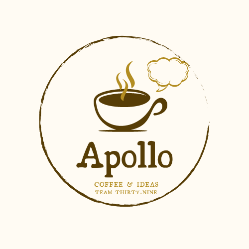
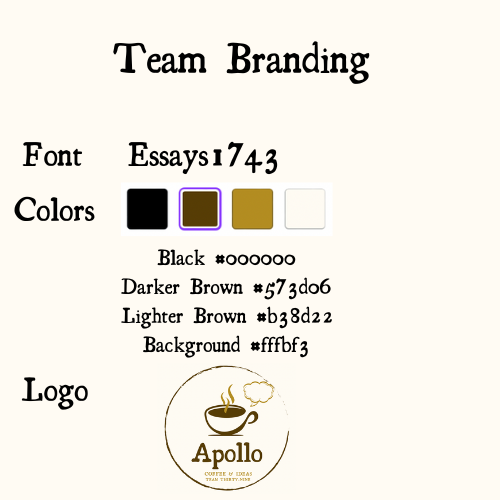
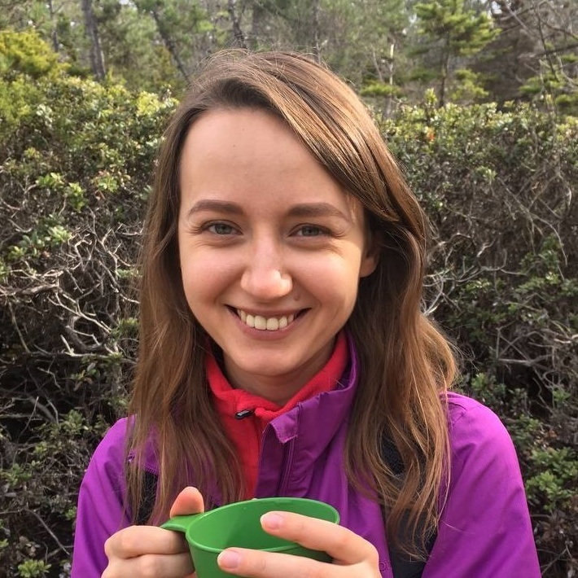
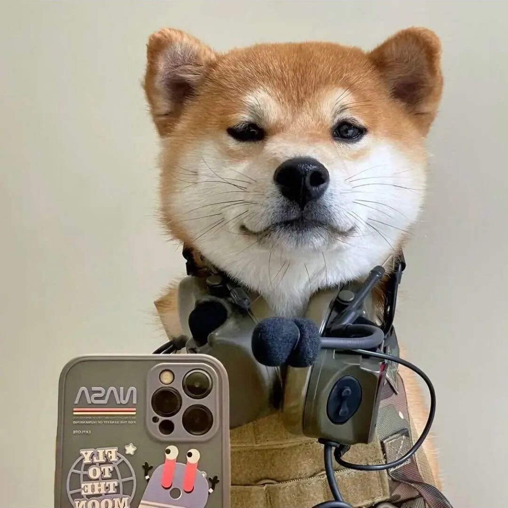
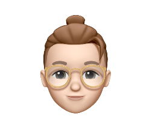
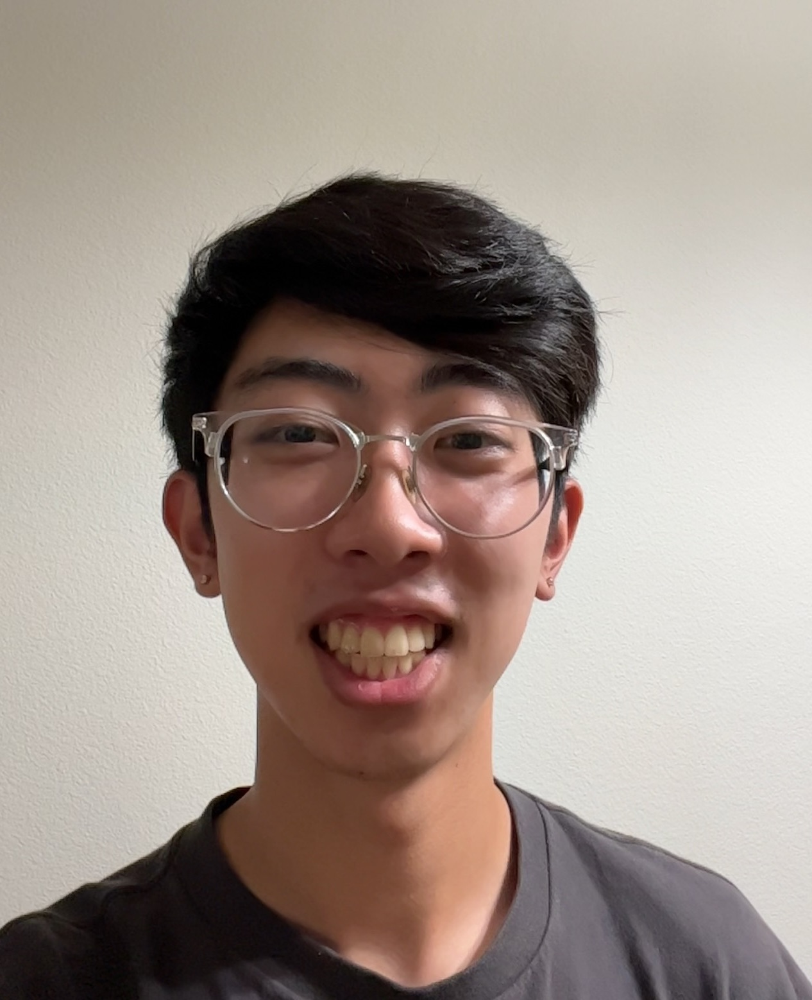
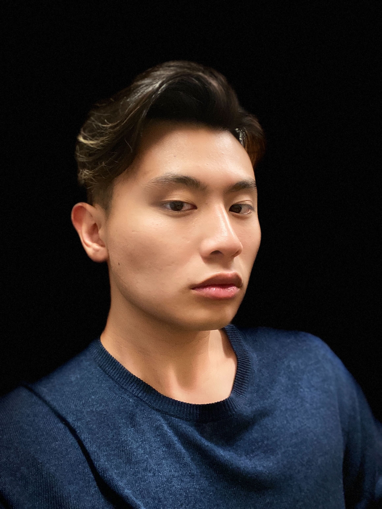

# Team Apollo

## Branding

> *Apollo* is a Greek and Roman god of knowledge. 

Our team will integrate every member's knowledge and ideas to create and build the project. 

We will make a **Coffee Ordering** web app that allows students to select coffee shops, make orders, and save preferences, because Coffee brings **inspiration and ideas**.

## Values

[Team Intro Video](videos/teamintro.mp4)
> **General Responsibilities**
>
> All members must put in their best effort to the work that they are responsible for. 
> 
> All members must show mutual respect toward each other in everything related to the group, such as in Slack chat and in their work. 
> 
> All members agree to receive a sign-off from one of the team lead before release of any changes to the project.

## Member Roster

    
    

        <h2>&emsp;<a href="https://github.com/tanya-bimatova">Tanya Bimatova</a></h2>
        
&nbsp; My name is Tatiana Bimatova. 
          &nbsp; I like writing in Java. I'm good at spotting bugs and at meticulous testing of software.
         &nbsp; Hobbies: hiking, board games, watching movies.

    

    
    

        <h2>&emsp;<a href="https://github.com/mingyi09">Mingyi Li</a></h2>
        
&nbsp; My name is Mingyi Li. 
          &nbsp; My favorite language is Java and Python. I'm good at prototyping and turning the design into real functional program. 
          &nbsp; My hobbies are hiking, reading, and just lying on the bed.

    

    
    

        <h2>&emsp;<a href="https://github.com/Hi9173">Justin He</a></h2>
        
&nbsp; My name is Justin He.
          &nbsp; I prefer to use C/C++ but Python is my favorite language as it is the first programming language I learned. 
          &nbsp; My hobbies are badminton, video games, and tiktok.

    

    
    

        <h2>&emsp;<a href="https://github.com/alien-traveler">Will Luo</a></h2>
        
&nbsp; My name is Will Luo.
          &nbsp; Java is my favorite so far. I'm good at paying attention to details when coding.
          &nbsp; My hobbies are tennis, video gaming, and cooking.

    

    
    

        <h2>&emsp;<a href="https://github.com/chaohaodu">Ryan Du</a></h2>
        
&nbsp; My name is Chaohao/Ryan Du.
          &nbsp; My favorite language is Java.
          &nbsp; I can do some backend job for our team project. I recently start to climb at the campus climbing center, and it is super fun! 

    

    
    

        <h2>&emsp;<a href="https://github.com/harryt1002">Harry Tang</a></h2>
        
&nbsp; My name is Harry Tang.
          &nbsp; My favorite languages are Java and Python. 
          &nbsp; I'm strong-headed when comes to solving complex problems. My hobbies are playing video games, running, and watching shows.
          &nbsp; 

    

    
    

        <h2>&emsp;<a href="https://github.com/JavaPersuader">Chuning Liu</a></h2>
        
&nbsp; My name is Logan(Chuning) Liu.
          &nbsp; My favorite language is C++. 
          &nbsp; I like sleeping, basketball, and playing video game such as Pokemon.

    

    
    

        <h2>&emsp;<a href="https://github.com/J4cky1ove">Jacky Hu</a></h2>
        
&nbsp; My name is Jacky Hu.
          &nbsp; My favorite language is C++, but Python is the most proficient programming language for me.
          &nbsp; I am good at writing algorithm for solving a problem. My hobbies is video gaming.   &nbsp; 

    

    
    

        <h2>&emsp;<a href="https://github.com/Noctrn">Vladimir Em</a></h2>
        
&nbsp; My name is Vladimir Em. 
          &nbsp; I like writing in Swift. I am good in UI and UX as well as any game development.
          &nbsp; Hobbies: Drifting, Racing and DYI projects.   &nbsp; 

    

    
    

        <h2>&emsp;<a href="https://github.com/RandiLi">Randi Li</a></h2>
        
&nbsp; My name is Randy Li. 
          &nbsp; My favorite programming language is Java. 
          &nbsp; I like solving problems through trial and error. My hobbies include movies, puzzles, and gaming.   &nbsp; 

    

